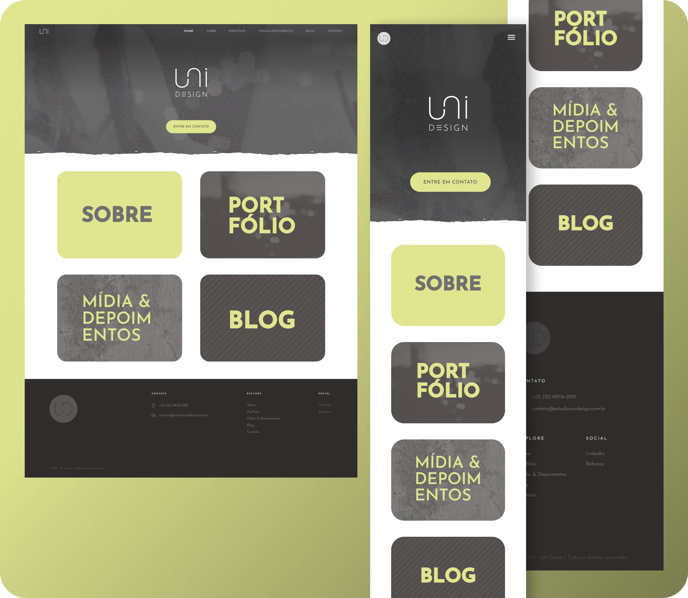

<div align="center">


  


</div>

<h1 align="center">Site Blog Estúdio UniDesign</h1>

### 📝 Sobre
Website institucional desenvolvido para o **Estúdio Uni Design**, em parceria com a designer **Nina Goes**. O projeto foi construído com foco em performance, adaptabilidade e uma experiência fluida para o usuário final, com design responsivo para **desktop**, **tablet** e **mobile**.

---

### 🚀 UI e Deploy
<div align="center">
<p >
  
</p>

[→ Ver Projeto On-line 🔗](https://uni-design-alpha.vercel.app/)

</div>

---

### 📋 Clone do repositório:

Abra o **VS Code**, pressione `Ctrl + Shift + P`, digite **"Git Clone"** e cole o link do repositório:
```sh
https://github.com/domfabio/Site-Blog-UniDesign.git
```

---

### 🤝 Contribuições

Contribuições são bem-vindas! Sinta-se à vontade para abrir *issues*, enviar *pull requests* ou sugerir melhorias.  
Este projeto está sob a licença **CC BY-NC 4.0**, o que significa que **não pode ser utilizado para fins comerciais**.  
Consulte o arquivo [`LICENSE`](./LICENSE) para mais informações.

---

> Desenvolvido por [@domfabio](https://github.com/domfabio) em parceria com o Estúdio Uni Design ✨